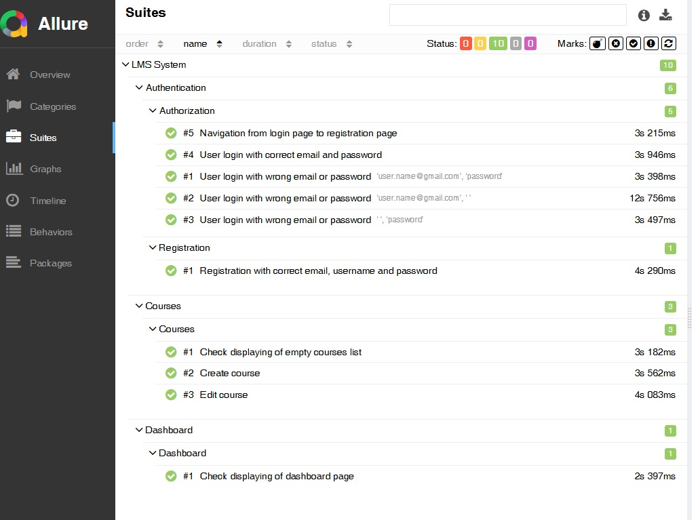

# Практическая работа с Allure аннотациями
[назад](./readme.md)

Содержание:
- [Задание](#задание)
- [Результат](#результат)

## Задание

В этом задании вам предстоит самостоятельно добавить следующие Allure аннотации к автотестам:
- *@allure.suite*
- *@allure.sub_suite*
- *@allure.parent_suite*

Мы уже добавляли аннотации *@allure.epic*, *@allure.feature*, *@allure.story*. Теперь ваша задача — добавить следующие аннотации для каждого тестового класса:- 
- **@allure.suite** — должна соответствовать значению *@allure.feature*. Это будет основной раздел, к которому относятся тесты.
- **@allure.parent_suite** — должна соответствовать значению *@allure.epic*. Это более высокий уровень категоризации, обозначающий основную группу функционала.
- **@allure.sub_suite** — должна соответствовать значению *@allure.story*. Это более узкий раздел, касающийся конкретных частей функционала.

### Критерии успешного выполнения
1. Размещение и значения аннотаций
    - Во всех **тестовых** классах добавлены аннотации:
        - *@allure.epic(...)*
        - *@allure.feature(...)*
        - *@allure.story(...)*
        - *@allure.parent_suite(...)*
        - *@allure.suite(...)*
        - *@allure.sub_suite(...)*
    - Связка значений выдержана один-в-один:
        - *@allure.parent_suite* = значение *@allure.epic*
        - *@allure.suite* = значение *@allure.feature*
        - *@allure.sub_suite* = значение *@allure.story*
    - Значения берутся из перечислений *AllureEpic*, *AllureFeature*, *AllureStory* (из *tools/allure/* *). Строковых литералов нет.

2. Покрытие классов
    - Аннотации добавлены к классам
        - TestAuthorization (epic=LMS, feature=AUTHENTICATION, story=AUTHORIZATION)
        - TestRegistration (epic=LMS, feature=AUTHENTICATION, story=REGISTRATION)
        - TestDashboard (epic=LMS, feature=DASHBOARD, story=DASHBOARD)
        - TestCourses (epic=LMS, feature=COURSES, story=COURSES)

3. Поведение отчёта
    - На вкладке Suites структура соответствует вкладке Behaviors
        - Уровень Parent suite — группы из AllureEpic.
        - Уровень Suite — разделы из AllureFeature.
        - Уровень Sub suite — подразделы из AllureStory
    - В дереве Suites нет «осиротевших» тестов без parent/suite/sub_suite.

4. Запуск
    - Тесты запускаются и проходят: python -m pytest -m "regression" -s -v
    - Отчёт Allure успешно строится: allure generate ./allure-results -o ./allure-report --clean
    - Структура соответствует критериям выше.

5. Качество реализации
    - Аннотации добавлены на уровне классов, а не функций.
    - Импорты allure и перечислений находятся вверху файлов, дубликатов/неиспользуемых импортов нет.
    - Код аккуратный, читабельный, соблюдён PEP8 (отступы, длина строк, порядок импортов).

[вверх](#практическая-работа-с-allure-аннотациями)


## Результат
```sh
vscode@6a6fc2b8982d:~/workspace$ source ./run_flake8.sh 
vscode@6a6fc2b8982d:~/workspace$ source ./run_pytest_allure_report.sh 
========================== test session starts =================================
platform linux -- Python 3.12.7, pytest-8.4.1, pluggy-1.6.0 -- /usr/local/bin/python3.12
cachedir: .pytest_cache
rootdir: /home/vscode/workspace
configfile: pytest.ini
plugins: rerunfailures-16.0.1, base-url-2.1.0, allure-pytest-2.15.0, playwright-0.7.1
collected 55 items / 45 deselected / 10 selected   

tests/authentication/test_authorization.py::TestAuthorization::test_wrong_email_or_password_authorization[user.name@gmail.com-password] PASSED
tests/authentication/test_authorization.py::TestAuthorization::test_wrong_email_or_password_authorization[user.name@gmail.com-  ] PASSED
tests/authentication/test_authorization.py::TestAuthorization::test_wrong_email_or_password_authorization[  -password] PASSED
tests/authentication/test_authorization.py::TestAuthorization::test_successful_authorization PASSED
tests/authentication/test_authorization.py::TestAuthorization::test_navigate_from_authorization_to_registration PASSED
tests/authentication/test_registration.py::TestRegistration::test_successful_registration PASSED
tests/courses/test_courses.py::TestCourses::test_empty_courses_list PASSED
tests/courses/test_courses.py::TestCourses::test_create_course PASSED
tests/courses/test_courses.py::TestCourses::test_edit_course PASSED
tests/dashboard/test_dashboard.py::TestDashboard::test_dashboard_displaying PASSED

========================== 10 passed, 45 deselected in 59.99s ==================
--output=./allure-report does not exist
Report successfully generated to allure-report
```

[вверх](#практическая-работа-с-allure-аннотациями)


Скриншот отчета Allure с разделом Suites


[вверх](#практическая-работа-с-allure-аннотациями)