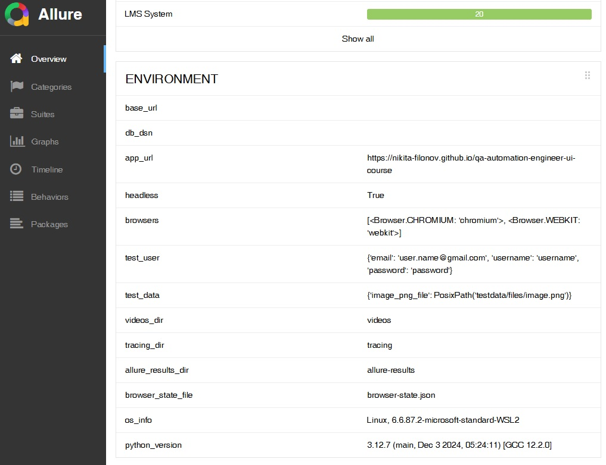

# Практика работы с переменными окружения в Allure
[назад](./readme.md)


В этом задании вам необходимо самостоятельно добавить в Allure отчет информацию об операционной системе, на которой запускаются автотесты, и версию интерпретатора Python, использованного для их запуска.

## Получение информации об операционной системе

Для получения информации об операционной системе можно использовать библиотеку platform. Пример кода:
```python
import platform

print(f'{platform.system()}, {platform.release()}')
```

## Получение информации о версии Python

Чтобы узнать текущую версию интерпретатора Python, можно использовать модуль sys. Пример кода:
```python
import sys

print(sys.version)
```

## Реализация

Все модификации нужно внести на уровне функции create_allure_environment_file, которая создаст файл environment.properties с данными об окружении. В этом файле укажите ключи и значения, отражающие информацию об операционной системе и версии Python.


## Критерии успешного выполнения

1. **Изменения в *create_allure_environment_file***
    - В функцию добавлено формирование строки с информацией об ОС.
    - В функцию добавлено формирование строки с информацией о версии Python
2. **Формат *environment.properties***
    - Все настройки из settings выгружаются в формате *ключ=значение*
    - В конце файла присутствуют новые строки
    - Структура соответствует требованиям Allure (plain-text key=value).
3. **Отображение в Allure-отчёте**
    - В разделе **Environment** Allure-отчёта отображаются новые поля
4. **Кроссплатформенность**
    - Используются стандартные модули Python (platform, sys) без внешних зависимостей.
    - Решение работает одинаково на Linux, macOS и Windows.
5. **Проверка результата**
    - При запуске тестов с генерацией Allure-отчёта в разделе Environment корректно видны:
      - значения из *settings* (*app_url*, *browsers*, *test_user*, *test_data* и др.)
      - добавленные строки *os_info* и *python_version*

## Скриншот полученного отчета Allure



[вверх](#практика-работы-с-переменными-окружения-в-allure)